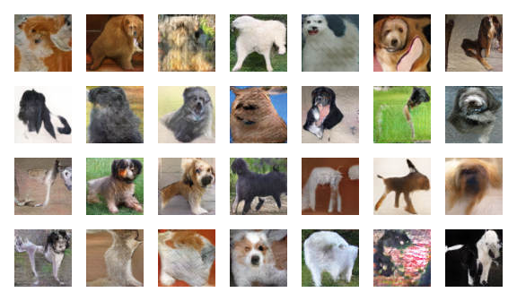

# Artistic Animal Generator

## How to run:
1. Open the kernel (Gan_train.ipynb) on Google Colab
2. Run all (make sure to use a GPU Runtime)

## Progress Updates:
- Deliverable 1: Data Selection Proposal
- Deliverable 2
- Deliverable 3

